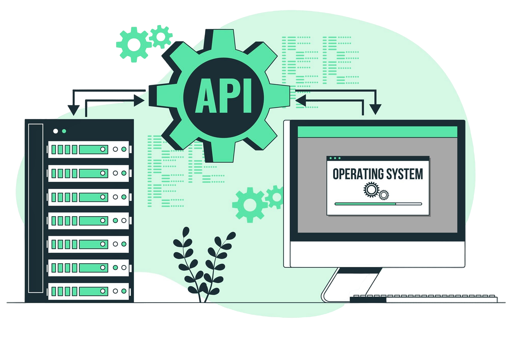

<p align="center">
  </img>
</p>

<h1 align="center"> CHALLENGE | Foro Alura - API REST </h1>

<p align="center">
  <code></code>
  <code></code>
  <code></code>
  <code></code>
  <code></code>  
</p>
<b>

<details>
  <summary>
    Contenido Importante
  </summary>

## 📝 Descripción

La API-REST de Foro Alura es una aplicación backend desarrollada para facilitar funcionalidades de foros de discusión. Construida con Java y Spring Boot, MySql, contruyendo metodos y endpoints robustos para gestionar tópicos, mensajes, autenticación de usuarios y más. Esta API se integra perfectamente con MySQL para el almacenamiento de datos y utiliza Srping Doc | Swagger para una documentación clara y detallada de la API.

## 🔨 Funcionalidades

* Registrar usuarios.
* Listar usuarios.
* Registrar topico.
* Listar topico.
* Registrar mensajes ...

## :open_file_folder: Estructura principal de carpetas 

```
Challenge_Foro_Alura
├──src
│   ├── main
│   │   └── controller
|   |   └── dto
|   |   └── infra
|   |   └── model
|   |   └── repository
|   |   └── service
|   |   |
|   |   └── ForoApiApplication.java
│   ├── resources
│   │   ├── db/migration
|   |   |
│   │   └── aplicaction.properties |
├── POM.XML
└── README.md
```
</details>

<details>
  <summary>
    Tegnologias Usadas
  </summary>
<div align="center">
  <br>

  
  
  
  
  
  
<div>
</details>

